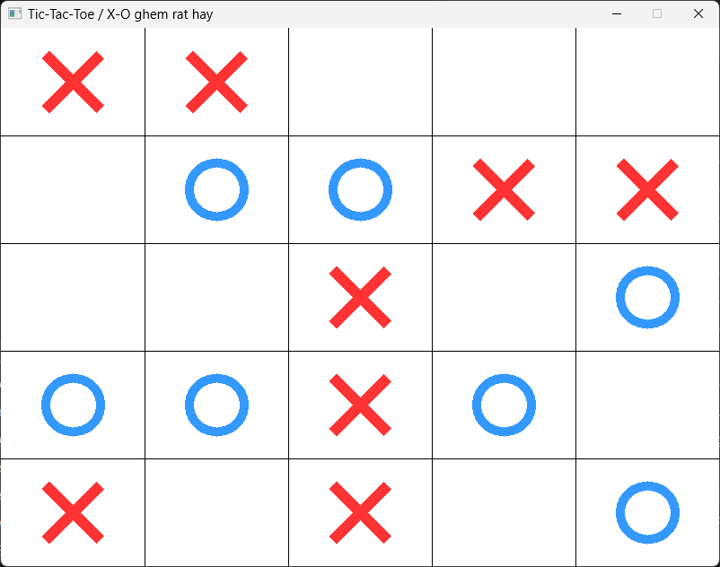

---

# ⇁ CoCaro
CoCaro, also known as Gomoku or Five in a Row, is a strategic board game that originated in East Asia and is played on a square grid. The game is similar to tic-tac-toe but is typically played on a larger board, making it more complex and challenging. The Vietnamese term for this game is Cờ caro.

Here are the basic rules for playing the 5x5 variation of CoCaro:

## Objective: ##
*The objective of the game is to be the first player to create a row of five consecutive markers, either horizontally, vertically, or diagonally on the game board.

## Game Setup: ##
*The game is played on a 5x5 grid.
*Players take turns placing their markers on an empty intersection point on the board.
*The first player typically uses 'X,' and the second player uses 'O.'

##Gameplay:
Players take turns placing their markers on empty intersections.
The game continues until one player achieves a row of five markers in a horizontal, vertical, or diagonal direction.
The game can also end in a draw if the entire board is filled, and no player has achieved the winning condition.

##Rules:
*Players cannot place more than one marker on the same intersection point.
*The game ends as soon as a player forms a row of five markers or when the board is completely filled.

##Strategy:
*Players aim to create an unbroken row of five markers, while also blocking their opponent from achieving the same.
*Controlling the center of the board is often crucial, as it provides opportunities for both offense and defense.
*Players must balance creating their winning combinations with preventing their opponent from doing the same.

CoCaro is a game that requires strategic thinking and foresight. The 5x5 variation adds an extra layer of complexity compared to the traditional 3x3 tic-tac-toe grid, making it an engaging and challenging pastime for players of all ages.

---

# ⇁ Warning
This is only a small project made by 1 man - tbthanh (with minor support from PHQK and NDNQ), so there will be some bugs that i don't know :cry:

---

# ⇁ Setup 
`SDL` required for this project to work. Run this command to install all dependencies needed:
```bash
updating this plz !!!
```
---

# ⇁ How to use
You need to execute `Attempt_4_cocaro.exe` file
```cmd
.\Attempt_4_cocaro.exe
```

# ⇁ Configuration

---

# ⇁ File structure
```
hmm
```
---
